# 📅 DailyFlow

> **AI가 당신의 일정을 이해하고 먼저 챙겨주는 스마트 일정 관리 애플리케이션**

DailyFlow는 Qt C++로 개발된 데스크톱 일정 관리 프로그램으로, OpenAI API와 날씨 API를 활용하여 사용자 맞춤형 AI 일정 요약 및 운세 서비스를 제공합니다.

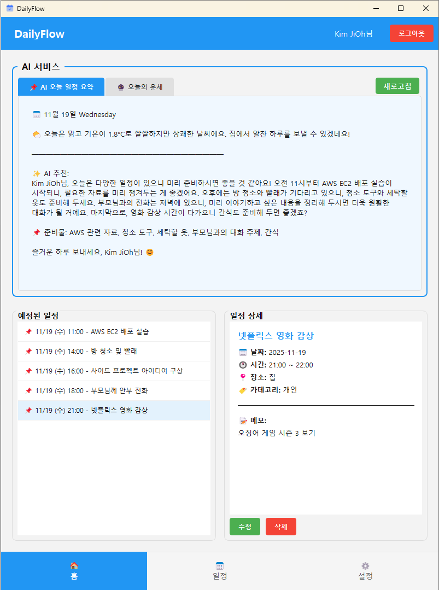

---

## 🌟 주요 특징

### 1. AI 기반 일정 요약
- **OpenAI GPT-4o-mini** 모델을 활용한 자연어 일정 요약
- 날씨 정보와 결합한 실용적인 조언 제공
- 사용자 이름을 포함한 맞춤형 친근한 톤

### 2. 실시간 날씨 연동
- **OpenWeatherMap API**를 통한 실시간 날씨 정보
- 사용자 주소 기반 지역 날씨 자동 감지
- 날씨를 고려한 준비물 추천

### 3. 직관적인 캘린더 UI
- 커스텀 QCalendarWidget 구현
- 일정이 있는 날짜 시각적 표시 (점 마커)
- 월별 일정 개수 표시

### 4. 다크모드/라이트모드 지원
- 사용자 설정에 따른 테마 전환
- 전체 UI 일관된 색상 체계
- 눈의 피로를 줄이는 다크모드

### 5. 안전한 회원 관리
- SHA-256 해싱 + Salt를 활용한 비밀번호 보안
- 10,000회 반복 해싱으로 브루트포스 공격 방지
- 회원정보 수정 및 비밀번호 변경 기능

---

## 시스템 아키텍처

### 기술 스택

| 분류 | 기술 |
|------|------|
| **언어** | C++17 |
| **프레임워크** | Qt 6.x |
| **데이터베이스** | SQLite (QSqlDatabase) |
| **AI API** | OpenAI API (GPT-4o-mini) |
| **날씨 API** | OpenWeatherMap API |
| **네트워킹** | QNetworkAccessManager |
| **빌드 시스템** | CMake |

### 주요 디자인 패턴

#### 1. **Singleton 패턴** (Meyer's Singleton)
```cpp
// DataManager, AIService
static DataManager& instance() {
    static DataManager instance;
    return instance;
}
```

#### 2. **MVC 패턴 변형**
- **Model**: DataManager (SQLite 데이터베이스 관리)
- **View**: UI 파일 (*.ui) + 커스텀 위젯
- **Controller**: Page 클래스 (HomePage, SchedulePage, SettingsPage)

#### 3. **Observer 패턴** (Signal-Slot)
```cpp
connect(&DataManager::instance(), &DataManager::scheduleChanged,
        this, [this](int userId) {
            if (userId == m_Id) {
                m_homePage->refreshSchedules();
            }
        });
```

---

## 📂 프로젝트 구조

```
DailyFlow/
├── CMakeLists.txt              # CMake 빌드 설정
├── .env                        # API 키 설정 파일 (Git 제외)
├── dailyflow.db                # SQLite 데이터베이스 (자동 생성)
│
├── main.cpp                    # 애플리케이션 진입점
├── mainwindow.h/cpp/ui         # 메인 윈도우 (네비게이션)
│
├── logindialog.h/cpp/ui        # 로그인 다이얼로그
├── joindialog.h/cpp/ui         # 회원가입 다이얼로그
│
├── homepage.h/cpp/ui           # 홈 페이지 (AI 요약, 운세)
├── schedulepage.h/cpp/ui       # 일정 관리 페이지 (캘린더)
├── settingspage.h/cpp/ui       # 설정 페이지 (회원정보, 테마)
├── scheduledialog.h/cpp/ui     # 일정 추가/수정 다이얼로그
│
├── datamanager.h/cpp           # 데이터베이스 관리 (Singleton)
├── aiservice.h/cpp             # AI API 호출 서비스 (Singleton)
└── envloader.h/cpp             # 환경 변수 로더
```

---

## 데이터베이스 스키마
### ERD 다이어그램
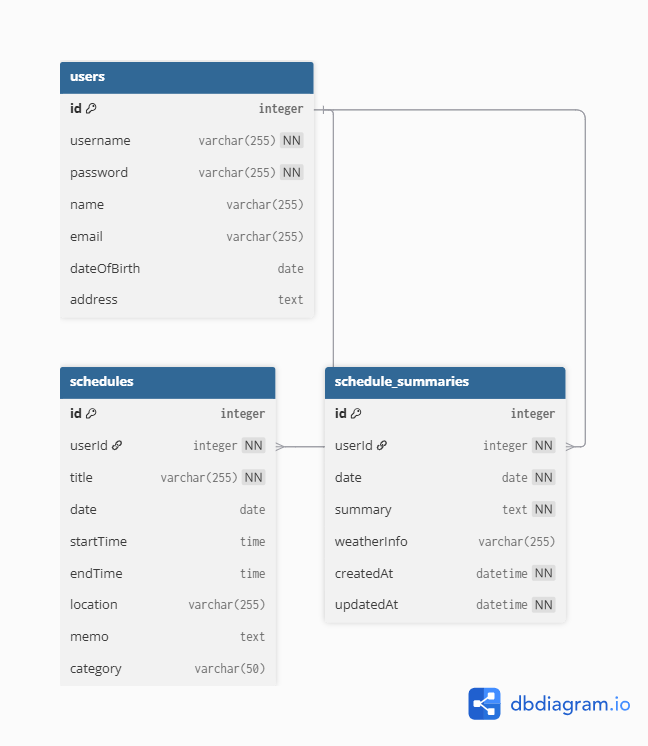

### **users** 테이블
| 컬럼 | 타입 | 설명 |
|------|------|------|
| id | INTEGER PRIMARY KEY | 사용자 고유 ID |
| username | TEXT UNIQUE NOT NULL | 로그인 아이디 |
| password | TEXT NOT NULL | 해시된 비밀번호 (Salt:Hash) |
| name | TEXT | 사용자 이름 |
| email | TEXT | 이메일 주소 |
| dateOfBirth | TEXT | 생년월일 (yyyy-MM-dd) |
| address | TEXT | 주소 |

### **schedules** 테이블
| 컬럼 | 타입 | 설명 |
|------|------|------|
| id | INTEGER PRIMARY KEY | 일정 고유 ID |
| userId | INTEGER NOT NULL | 사용자 ID (FK) |
| title | TEXT NOT NULL | 일정 제목 |
| date | TEXT | 일정 날짜 (yyyy-MM-dd) |
| startTime | TEXT | 시작 시간 (HH:mm) |
| endTime | TEXT | 종료 시간 (HH:mm) |
| location | TEXT | 장소 |
| memo | TEXT | 메모 |
| category | TEXT | 카테고리 (업무/개인/학습/기타) |

### **schedule_summaries** 테이블
| 컬럼 | 타입 | 설명 |
|------|------|------|
| id | INTEGER PRIMARY KEY | 요약 고유 ID |
| userId | INTEGER NOT NULL | 사용자 ID (FK) |
| date | TEXT NOT NULL | 날짜 (yyyy-MM-dd) |
| summary | TEXT NOT NULL | AI 생성 요약 |
| weatherInfo | TEXT | 날씨 정보 |
| createdAt | TEXT NOT NULL | 최초 생성 시각 |
| updatedAt | TEXT NOT NULL | 마지막 업데이트 시각 |
| UNIQUE(userId, date) | | 사용자당 하루에 하나의 요약만 |

---

## 설치 및 실행

### 1. 사전 요구사항

- **Qt 6.x** (Qt Creator 권장)
- **CMake 3.16 이상**
- **C++17 지원 컴파일러**
  - Windows: MSVC 2019 이상 또는 MinGW
  - Linux: GCC 7 이상
  - macOS: Clang 5 이상

### 2. API 키 발급

#### OpenAI API 키
1. [OpenAI Platform](https://platform.openai.com/) 접속
2. API Keys 메뉴에서 새 키 생성
3. `gpt-4o-mini` 모델 사용 (저렴하고 빠름)

#### OpenWeatherMap API 키
1. [OpenWeatherMap](https://openweathermap.org/api) 접속
2. 무료 플랜 가입 (1000 calls/day)
3. API Key 발급

### 3. 환경 설정

프로젝트 루트 디렉토리에 `.env` 파일 생성:

```env
OPENAI_API_KEY=sk-proj-your-openai-api-key-here
WEATHER_API_KEY=your-openweathermap-api-key-here
```

** 중요**: `.env` 파일은 절대 Git에 커밋하지 마세요!

### 4. 빌드 및 실행

#### Qt Creator 사용
```bash
1. Qt Creator에서 CMakeLists.txt 열기
2. 빌드 구성 선택 (Release 권장)
3. 빌드 후 실행
```

---

## 📱 주요 화면

### 1. 로그인 화면
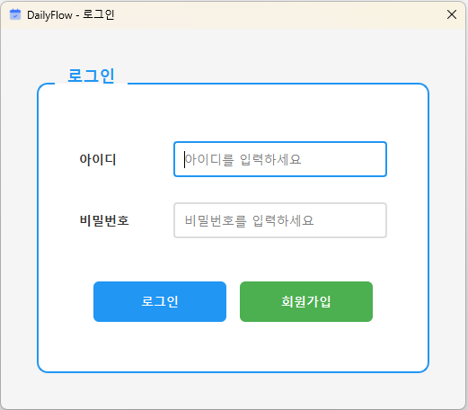
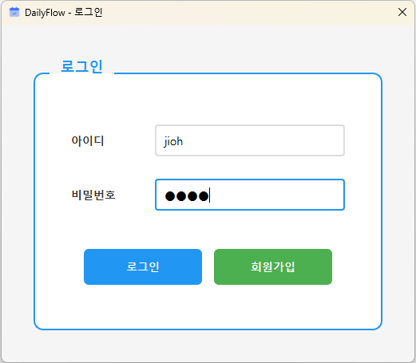

- 아이디/비밀번호 입력
- 회원가입 버튼

### 2. 회원가입 화면
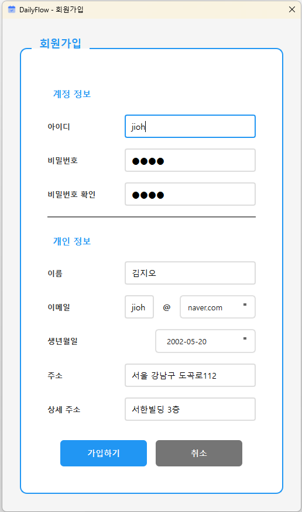

- 사용자 정보 입력 (이름, 이메일, 생년월일, 주소)
- 입력 유효성 검사

### 3. 홈 페이지 (AI 요약)

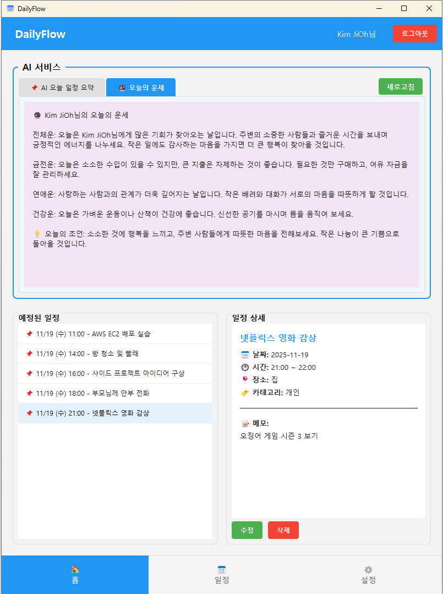
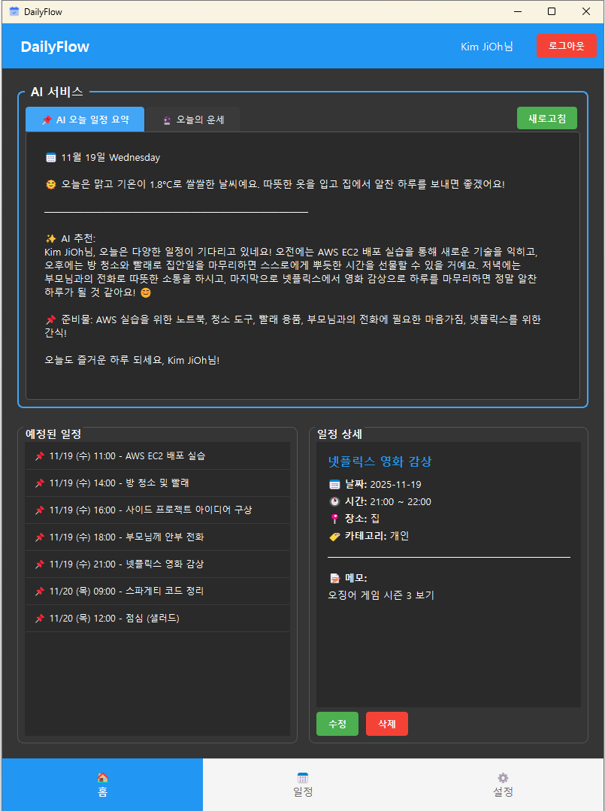

#### AI 일정 요약 탭
```
📅 11월 19일 Wednesday

🌦️ 오늘은 기온이 맑고 1.8°C로 쌀쌀하지만 상쾌한 날씨에요. 집에서 알찬 하루를 보낼 수 있겠네요!

━━━━━━━━━━━━━━━━━━━━━━━━━━━

✨ AI 추천:
Kim JiOh님, 오늘은 다양한 일정이 있으니 미리 준비하시면 좋을 것 같아요! 오전 11시부터 AWS EC2 배포 실습이 시작되니, 필요한 자료를 미리 챙겨두는 게 좋겠어요. 오후에는 방 청소와 빨래가 기다리고 있으니, 청소 도구와 세탁할 옷도 준비해 두세요. 부모님과 전화는 저녁에 있으니, 미리 이야기하고 싶은 내용을 정리해 두시면 더욱 원할한 대화가 될 거에요. 마지막으로, 영확 감상 시간이 다가오니 간식도 준비해 두면 좋겠죠?

📌 준비물: AWS 관련 자료

즐거운 하루 보내세요, Kim JiOh님!
```

#### 오늘의 운세 탭
```
🔮 11월 19일 Wednesday 엄도윤님의 운세  
생년월일: 2022-02-03 (만 3세)

전체운: 오늘은 엄도윤님에게 새로운 경험이 가득한 하루가 될 것 같아요. 주변 친구들과 함께 놀면서 즐거운 시간을 보내고, 그 속에서 많은 것을 배우게 될 거예요. 열린 마음으로 세상을 바라보면 더 많은 기쁨을 느낄 수 있을 것입니다.

금전운: 오늘은 소중한 장난감을 잃어버리지 않도록 조심하세요. 작은 것에도 신경 쓰는 것이 중요해요!

연애운: 친구들과의 우정이 더욱 깊어지는 날이에요. 서로의 마음을 나누고 함께하는 시간을 소중히 여기세요.

건강운: 활발하게 움직이는 날이 될 것 같아요. 충분히 놀고 뛰어다니면서 건강을 잘 챙기세요!

💡 오늘의 조언: 새로운 것을 시도해보는 날로 삼아보세요. 친한 친구와 함께하는 활동이 더욱 즐거울 거예요!
```

### 4. 일정 관리 페이지
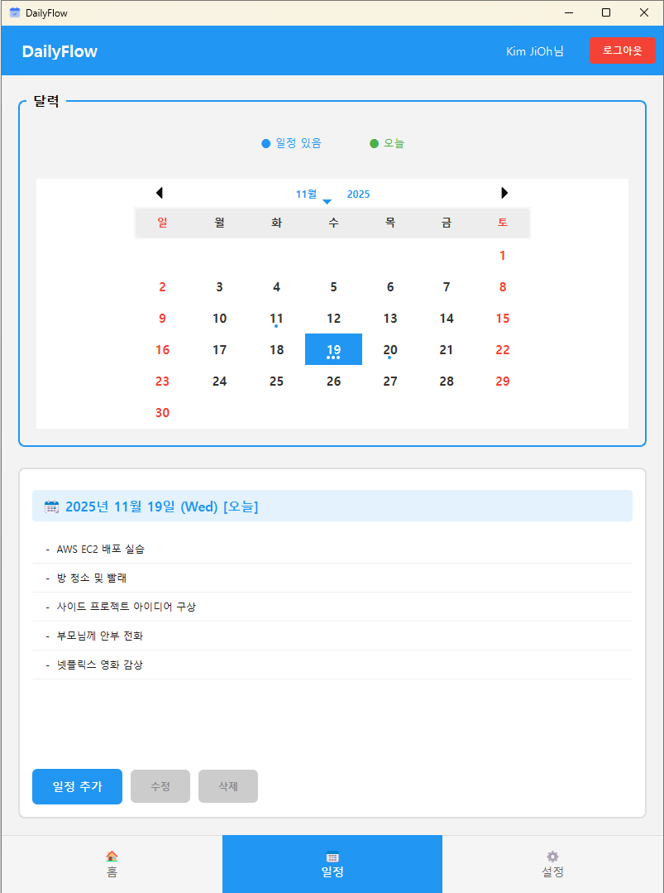
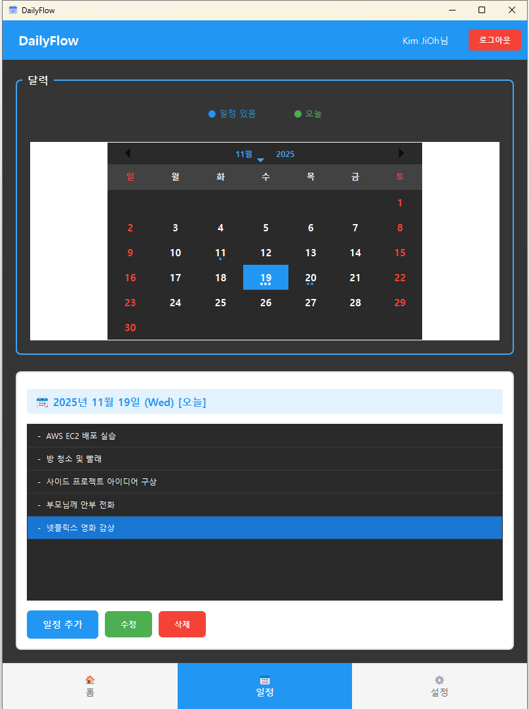

- 월간 캘린더 뷰 (커스텀 디자인)
- 일정이 있는 날짜 점 표시 (최대 3개)
- 선택한 날짜의 일정 리스트
- 일정 추가/수정/삭제 버튼

### 5. 일정 추가/수정 다이얼로그
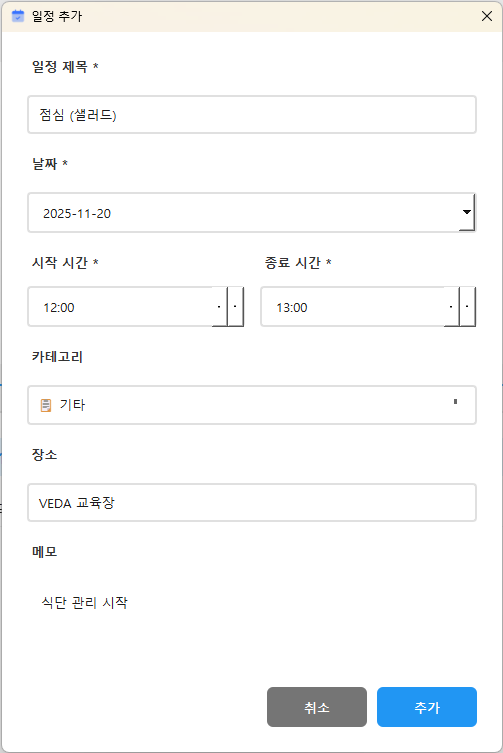

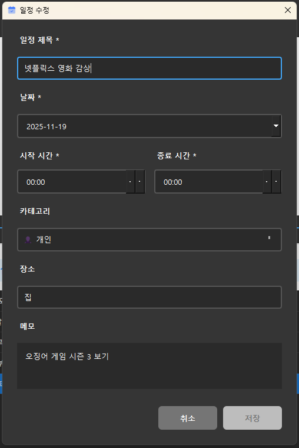

- 제목, 날짜, 시간, 장소, 메모 입력
- 카테고리 선택 (🏢 업무 / 👤 개인 / 📚 학습 / 🎯 기타)
- 실시간 입력 유효성 검사

### 6. 설정 페이지
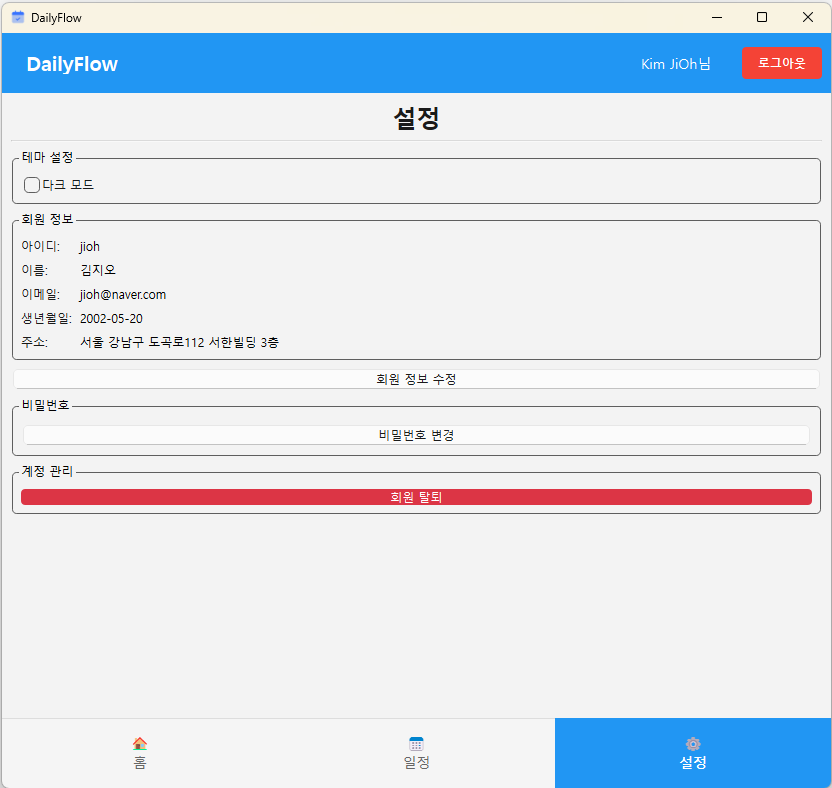
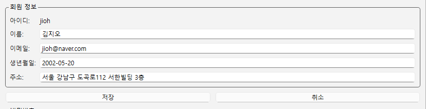

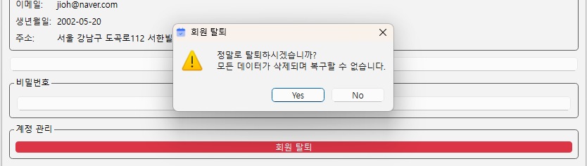
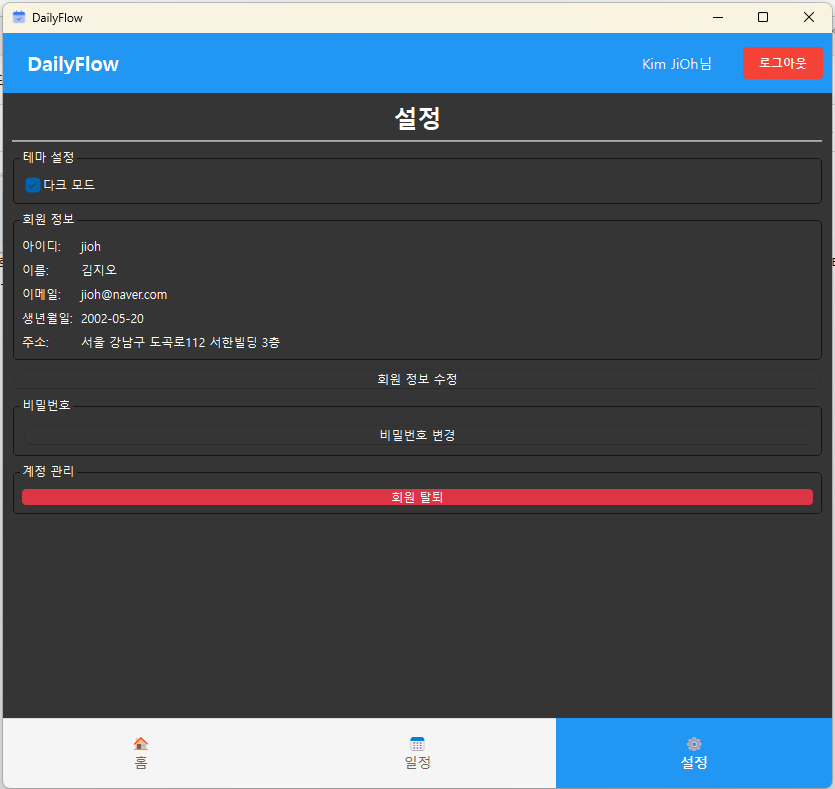

- 회원정보 조회/수정
- 비밀번호 변경
- 회원 탈퇴
- 다크모드 토글

---

## 🎨 UI/UX 특징

### 커스텀 캘린더 위젯 (CustomCalendar)

```cpp
class CustomCalendar : public QCalendarWidget
{
    // 주요 기능:
    // 1. 일정 개수에 따른 점 마커 표시 (1~3개)
    // 2. 선택된 날짜 파란색 배경
    // 3. 오늘 날짜 초록색 테두리
    // 4. 주말 빨간색 텍스트
    // 5. 다크모드 지원
    
protected:
    void paintCell(QPainter *painter, const QRect &rect, QDate date) const override;
    void wheelEvent(QWheelEvent *event) override; // 휠 스크롤 비활성화
};
```

### 테마 시스템

- **QSettings**를 활용한 설정 영속화
- 전역 테마 변경 시그널 전파

```cpp
// SettingsPage에서 테마 변경 시
emit themeChanged(isDarkMode);

// 각 Page에서 수신
connect(m_settingsPage, &SettingsPage::themeChanged,
        m_homePage, &HomePage::applyTheme);
```

### 반응형 디자인

- 모든 UI 요소 적절한 간격 유지
- 버튼 hover/pressed 상태 피드백
- 비활성화 버튼 시각적 차별화

---

## 🤖 AI 기능 상세

### 1. 일정 요약 생성 프로세스

```
1. 사용자 정보 조회 (이름, 주소, 생년월일)
   ↓
2. 주소에서 지역명 파싱 (서울특별시 → Seoul)
   ↓
3. 날씨 API 호출 (OpenWeatherMap)
   ↓
4. 오늘 일정 데이터 조회 (SQLite)
   ↓
5. 프롬프트 생성 (일정 + 날씨 + 사용자 정보)
   ↓
6. OpenAI API 호출 (GPT-4o-mini)
   ↓
7. AI 응답 파싱 및 DB 캐싱
   ↓
8. UI에 표시
```

### 2. 캐싱 전략

- **일정 변경 시**: 해당 날짜 요약 무효화 (`invalidateSummary`)
- **재요청 시**: 캐시 우선 확인 (`getCachedSummary`)
- **자동 정리**: 30일 이상 된 요약 자동 삭제 (`cleanOldSummaries`)

```cpp
// 일정 추가/수정/삭제 시 자동 무효화
bool success = DataManager::instance().addSchedule(...);
if (success) {
    DataManager::instance().invalidateSummary(m_userId, date);
}
```

### 3. API 호출 최적화

- **동기 호출**: QEventLoop로 UI 블로킹 방지
- **에러 처리**: API 실패 시 대체 텍스트 제공
- **재시도 로직**: 네트워크 오류 시 사용자에게 재시도 옵션

```cpp
// 동기 호출 예시
QEventLoop loop;
QNetworkReply* reply = m_networkManager->post(request, data);
QObject::connect(reply, &QNetworkReply::finished, &loop, &QEventLoop::quit);
loop.exec(); // 응답 대기
```

---

## 🔐 보안 기능

### 비밀번호 해싱 (Salt + SHA-256)

```cpp
QString DataManager::hashPassword(const QString& password)
{
    // 1. 16바이트 랜덤 Salt 생성
    QByteArray salt;
    for(int i = 0; i < 16; i++) {
        salt.append(static_cast<char>(QRandomGenerator::global()->generate()));
    }
    
    // 2. 10,000회 반복 해싱 (Brute-force 방지)
    QByteArray hash = password.toUtf8() + salt;
    for(int i = 0; i < 10000; i++) {
        hash = QCryptographicHash::hash(hash, QCryptographicHash::Sha256);
    }
    
    // 3. "Salt:Hash" 형식으로 저장
    return salt.toHex() + ":" + hash.toHex();
}
```

### 비밀번호 검증

```cpp
bool DataManager::verifyPassword(const QString& password, const QString& storedHash)
{
    // 1. 저장된 Hash에서 Salt 추출
    QStringList parts = storedHash.split(":");
    QByteArray salt = QByteArray::fromHex(parts[0].toUtf8());
    QByteArray originalHash = QByteArray::fromHex(parts[1].toUtf8());
    
    // 2. 입력된 비밀번호로 동일한 과정 수행
    QByteArray hash = password.toUtf8() + salt;
    for(int i = 0; i < 10000; i++) {
        hash = QCryptographicHash::hash(hash, QCryptographicHash::Sha256);
    }
    
    // 3. 해시 비교
    return hash == originalHash;
}
```

---

## 개발 및 테스트

### 개발 환경

- **IDE**: Qt Creator 13.x
- **디버깅**: Qt Creator 내장 디버거 (GDB/LLDB)
- **버전 관리**: Git

### 테스트 체크리스트

#### 회원 관리
- [ ] 회원가입 (중복 아이디 검증)
- [ ] 로그인 (잘못된 비밀번호 처리)
- [ ] 회원정보 수정
- [ ] 비밀번호 변경
- [ ] 회원 탈퇴 (관련 데이터 삭제 확인)

#### 일정 관리
- [ ] 일정 추가 (유효성 검사)
- [ ] 일정 수정
- [ ] 일정 삭제
- [ ] 캘린더 월 이동
- [ ] 날짜별 일정 조회

#### AI 기능
- [ ] 첫 요약 생성 (API 호출)
- [ ] 캐시된 요약 로드
- [ ] 일정 변경 시 요약 무효화
- [ ] 날씨 정보 표시
- [ ] 오늘의 운세 생성

#### UI/UX
- [ ] 다크모드 전환
- [ ] 테마 설정 영속화
- [ ] 버튼 상태 전환
- [ ] 에러 메시지 표시

---

## 성능 최적화

### 1. 데이터베이스 인덱싱

```sql
-- userId와 date 복합 인덱스로 조회 속도 향상
CREATE INDEX idx_schedules_user_date ON schedules(userId, date);
CREATE INDEX idx_summaries_user_date ON schedule_summaries(userId, date);
```

### 2. 캐싱 전략

- AI 요약 DB 캐싱 (재계산 방지)
- 날씨 정보 포함 저장 (API 호출 최소화)

### 3. UI 렌더링 최적화

```cpp
// 캘린더 렌더링 최적화
void CustomCalendar::updateVisibleRows()
{
    // 현재 보이는 주만 렌더링
    for (int row = 0; row < 6; ++row) {
        tableView->setRowHidden(row, false);
    }
}
```

---

## 이슈 및 해결 방법

### 1. .env 파일 경로 오류
**증상**: "OPENAI_API_KEY is not set!" 경고
**해결**: `main.cpp`에서 `.env` 파일 절대 경로 확인

### 2. 한글 인코딩 깨짐
**증상**: UI 텍스트 깨짐
**해결**: 소스 파일을 UTF-8 BOM 없이 저장

### 3. API 키 무효화
**증상**: API 호출 실패
**해결**: OpenAI/OpenWeatherMap 대시보드에서 키 유효성 확인

---

## 향후 개발 계획

### Phase 1 (단기)
- [ ] 일정 반복 기능 (매일/매주/매월)
- [ ] 일정 알림 기능 (시스템 알림)
- [ ] 일정 내보내기 (iCal 형식)

### Phase 2 (중기)
- [ ] 구글 캘린더 동기화
- [ ] 다국어 지원 (영어, 일본어)
- [ ] 일정 공유 기능

### Phase 3 (장기)
- [ ] 모바일 앱 (Qt for Mobile)
- [ ] 웹 버전 (Qt WebAssembly)
- [ ] 팀 협업 기능

---

## 개발팀

### 프로젝트 리더 & 백엔드
**엄도윤**
- **역할**: 
  - 데이터베이스 설계 및 구현
  - AI API 연동 (OpenAI, OpenWeatherMap)
  - 회원 관리 시스템
  - 환경 변수 관리

**김지오**
### UI/UX 디자이너 & 프론트엔드
- **역할**: 
  - 커스텀 캘린더 위젯 개발
  - 일정 다이얼로그 UI
  - 다크모드 테마 시스템
  - 반응형 레이아웃

---

## 라이선스

이 프로젝트는 학습 목적으로 제작되었습니다.

- **Qt Framework**: [LGPL v3](https://www.qt.io/licensing/)
- **OpenAI API**: [OpenAI Terms of Use](https://openai.com/policies/terms-of-use)
- **OpenWeatherMap API**: [OWM Terms](https://openweathermap.org/terms)

---

## 문의 및 피드백

- **기술 문서**: [Qt Documentation](https://doc.qt.io/)
- **OpenAI API 문서**: [OpenAI API Reference](https://platform.openai.com/docs/)
- **OpenWeatherMap API 문서**: [OWM API Guide](https://openweathermap.org/api)

---

**Made with ❤️ by DailyFlow Team**
